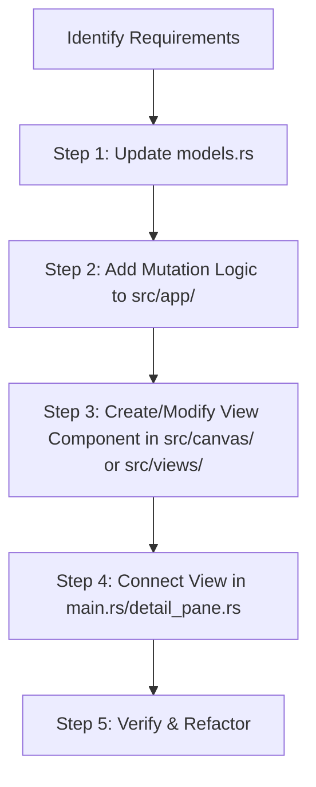

# Codebase Organization & Feature Development Guidelines (GPUI/Rust)

This document outlines the architectural standards, code organization principles, and step-by-step procedures for modifying or adding features to this GPUI-based Rust Notes/Todo application. All agents working on this project must strictly adhere to these guidelines.

---

## 1. Directory & File Structure Map

The codebase is organized into modular subdirectories to prevent single-file bloat and keep every file small, focused, and maintainable.

```text
todo-app-gpui/
├── .agents/
│   └── AGENTS.md            # [This File] Agent rules & architecture guidelines
├── Cargo.toml               # Package dependencies & build profiles
├── src/
│   ├── main.rs              # Application entry point, window management, root App render
│   ├── models.rs            # Plain Data Models (Note, NotePage, NoteSection, CanvasItem) & Serialization
│   ├── helpers.rs           # Utilities: Hashing, encryption, range replacement
│   ├── text_selection.rs    # Text selection, char width, hit testing & cursor navigation
│   ├── app/                 # Application Controller & State Mutations
│   │   ├── mod.rs           # NotesApp struct definition & Focusable implementation
│   │   ├── storage.rs       # Persistence (notes.json), storage paths & image XOR encryption
│   │   ├── actions.rs       # Notebook, section & page CRUD & edit state transitions
│   │   └── key_handler.rs   # Keyboard shortcuts & text editing input handler
│   ├── canvas/              # Interactive & Read-only Canvas Components
│   │   ├── mod.rs           # Module exports for canvas view components
│   │   ├── editor.rs        # Interactive canvas editor layout & event listeners
│   │   ├── editor_items.rs  # Canvas text & image block rendering and controls
│   │   ├── editor_header.rs # Section tabs toolbar & inline section/heading editors
│   │   └── viewer.rs        # Read-only note display canvas
│   └── views/               # Top-level UI View Components
│       ├── mod.rs           # Module exports for main layout views
│       ├── sidebar.rs       # View: Sidebar navigation & notebook list rendering
│       └── detail_pane.rs   # View: Main detail view/editor layout rendering
```

---

## 2. Core Architectural Principles

When adding features or refactoring, apply the following design patterns:

### A. Strict Separation of Concerns (MVC-like)
1. **Data Models (`src/models.rs`)**:
   - Keep models pure. They should only contain data structures, `serde` serialization/deserialization traits, and constructor functions.
   - **No GPUI rendering or context-bound logic** should exist in `models.rs`.
2. **State & Mutation (`src/app/`)**:
   - `NotesApp` is the central state store defined in `src/app/mod.rs`.
   - State-changing functions (e.g., adding a page, deleting a section, saving a note) are implemented in `src/app/actions.rs`.
   - Persistence and image encryption/decryption are encapsulated in `src/app/storage.rs`.
   - Keyboard events and input shortcuts are handled in `src/app/key_handler.rs`.
3. **UI Views & Widgets (`src/canvas/`, `src/views/`)**:
   - Keep view logic organized inside dedicated domain subdirectories (`src/canvas/` for canvas widgets, `src/views/` for main layout views).
   - Keep rendering logic "thin." Do not perform complex calculations or state updates inside rendering loops. Delegate actions to state-mutation methods on `NotesApp` and notify GPUI to repaint via `cx.notify()`.

### B. Prevention of Monolithic Files (Max 800-Line Limit)
* **Goal**: No single source file should exceed **800 lines** of code. Keep files preferably under **400 lines**.
* **If a file exceeds 800 lines**:
  - Extract sub-components into new dedicated module files within the relevant subdirectory (e.g., `src/canvas/`, `src/app/`, or `src/views/`).
  - Extract complex pure functions (like cryptography, string algorithms, or formatting) into `src/helpers.rs` or new utility sub-modules.

### C. Context Handling & Ownership in GPUI
* GPUI relies on `AppContext` and `WindowContext` to track and trigger UI updates.
* **Avoid Cloning State**: Use handles (`Entity<T>` or similar GPUI state management wrappers) where possible.
* **Repaint Notifications**: Remember to call `cx.notify()` at the end of state-modifying actions inside context callbacks to trigger a UI update.

### D. Visibility Control
* Favor encapsulation. Use `pub(crate)` for modules, structs, and fields that are shared within the application but should not be exposed globally.
* Use `pub(super)` to restrict access to parent modules for internal helpers.

---

## 3. Step-by-Step: Adding a New Feature

Follow this workflow whenever a user requests a new capability (e.g., "Add a tagging system to notes" or "Support text formatting on the canvas"):



### Step 1: Model the Data
* Open [models.rs](file:///c:/Users/gorai/OneDrive/Desktop/todo-app-gpui/src/models.rs).
* Declare new structs or update existing structures (e.g., `Note`, `NotePage`).
* Add serialization tags if the new properties need to persist inside `notes.json`.

### Step 2: Implement State Mutation Logic
* Open [actions.rs](file:///c:/Users/gorai/OneDrive/Desktop/todo-app-gpui/src/app/actions.rs) or appropriate file in `src/app/`.
* Update `NotesApp` state methods to handle the new capability and call `cx.notify()` to alert GPUI.

### Step 3: Implement/Update the UI View
* If the view logic is canvas-related, place it in [canvas/](file:///c:/Users/gorai/OneDrive/Desktop/todo-app-gpui/src/canvas/).
* If it is a top-level layout element, place it in [views/](file:///c:/Users/gorai/OneDrive/Desktop/todo-app-gpui/src/views/).

### Step 4: Connect the UI to the App Layout
* Integrate the new visual elements into the layout.
* Bind user inputs (clicks, keypresses) to the state mutation methods.

### Step 5: Verify Compilation and Run Tests
* Run `cargo check` and `cargo build` to ensure no compiler or borrow-checker errors.
* Verify changes locally before completing the task.

---

## 4. Coding Style Constraints

* **Do not use `unwrap()` or `expect()` in production paths** unless it is mathematically impossible to fail. Implement clean error handling using `if let` or `match`.
* **Stack Overflow Prevention**: Windows main threads have small stacks. Keep recursion low and avoid placing massive arrays directly on the stack. The main entry point reserves a 64MB stack for UI rendering.
* **Linting & Warnings**: All code changes should compile warning-free. Always fix unused import and variable warnings before declaring a task finished.
