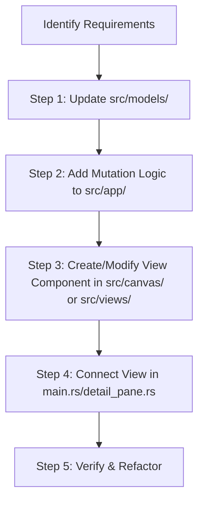

# Codebase Organization & Feature Development Guidelines (GPUI/Rust)

This document outlines the architectural standards, code organization principles, and step-by-step procedures for modifying or adding features to this GPUI-based Rust Notes/Todo application. All agents working on this project must strictly adhere to these guidelines.

---

## 1. Directory & File Structure Map

The codebase is organized into modular subdirectories to prevent single-file bloat and keep every file small, focused, and maintainable.

```text
todo-app-gpui/
├── .agents/
│   └── AGENTS.md                 # [This File] Agent rules & architecture guidelines
├── Cargo.toml                    # Package dependencies & build profiles
├── src/
│   ├── main.rs                   # Window startup and the root layout (sidebar + detail pane)
│   ├── constants.rs              # Colors, font sizes, and layout numbers
│   ├── helpers.rs                # Stable ids, string edits, and image-byte XOR
│   ├── models/                   # Saved data. No GPUI rendering here.
│   │   ├── mod.rs                # Note, section, page, and which field has focus
│   │   └── canvas.rs             # Text, image, and mixed blocks, plus load/save
│   ├── text/                     # Pure text layout shared by every editor
│   │   ├── metrics.rs            # Character width per font
│   │   ├── selection.rs          # Hit testing, line width, and cursor movement
│   │   └── styles.rs             # Bold, italic, underline, and strikethrough runs
│   ├── app/                      # NotesApp state and the operations that change it
│   │   ├── mod.rs                # NotesApp fields and focus handle
│   │   ├── notebook.rs           # Create, select, and delete notebooks; sidebar
│   │   ├── outline.rs            # Sections and pages inside the open notebook
│   │   ├── editing.rs            # Open, sync, save, and cancel an editing session
│   │   ├── formatting.rs         # Character styles and font settings
│   │   ├── keyboard.rs           # Key routing into the active field
│   │   ├── storage.rs            # notes.json and encrypted image files
│   │   ├── metadata.rs           # Pinned left bar and ribbon, saved beside notes.json
│   │   └── history/              # Undo and redo. See UNDO_REDO.md before changing content
│   │       ├── mod.rs            # Stacks, record_edit, undo, and redo
│   │       ├── kind.rs           # EditKind and which edits merge
│   │       ├── snapshot.rs       # Capture and restore one document step
│   │       └── tests.rs          # In-memory regression tests
│   ├── canvas/                   # The page surface
│   │   ├── editor.rs             # Editable canvas shell: pan, drag, pointer routing
│   │   ├── header.rs             # Section tabs and inline heading editors
│   │   ├── blocks.rs             # Text, image, and mixed blocks on the editor
│   │   ├── text_segment.rs       # One editable text segment
│   │   ├── viewer.rs             # Read-only page canvas
│   │   ├── viewer_text.rs        # Selection inside viewer text
│   │   └── text_editor.rs        # Reusable styled text field
│   └── views/                    # Top-level layout
│       ├── sidebar.rs            # Notebook list
│       ├── detail_pane.rs        # Page list plus editor or viewer
│       └── ribbon.rs             # Home formatting commands
```

---

## 2. Core Architectural Principles

When adding features or refactoring, apply the following design patterns:

### A. Strict Separation of Concerns (MVC-like)
1. **Data Models (`src/models/`)**:
   - Keep models pure. They should only contain data structures, `serde` serialization/deserialization traits, and constructor functions.
   - Notebook shape lives in `src/models/mod.rs`. Canvas blocks live in `src/models/canvas.rs`.
   - **No GPUI rendering or context-bound logic** should exist in `models`.
2. **State & Mutation (`src/app/`)**:
   - `NotesApp` is the central state store defined in `src/app/mod.rs`.
   - Put each behavior in the module that already owns that job: `notebook`, `outline`, `editing`, `formatting`, `keyboard`, or `storage`.
   - Persistence and image encryption/decryption stay in `src/app/storage.rs`.
   - Keyboard events stay in `src/app/keyboard.rs`.
3. **UI Views & Widgets (`src/canvas/`, `src/views/`)**:
   - Keep view logic organized inside dedicated domain subdirectories (`src/canvas/` for canvas widgets, `src/views/` for main layout views).
   - Keep rendering logic "thin." Do not perform complex calculations or state updates inside rendering loops. Delegate actions to state-mutation methods on `NotesApp` and notify GPUI to repaint via `cx.notify()`.

### B. Prevention of Monolithic Files (Max 800-Line Limit)
* **Goal**: No single source file should exceed **800 lines** of code. Keep files preferably under **400 lines**.
* **If a file exceeds 800 lines**:
  - Extract sub-components into new dedicated module files within the relevant subdirectory (e.g., `src/canvas/`, `src/app/`, or `src/views/`).
  - Extract text layout into `src/text/`. Keep `src/helpers.rs` for ids, string edits, and image bytes only.

### C. Context Handling & Ownership in GPUI
* GPUI relies on `AppContext` and `WindowContext` to track and trigger UI updates.
* **Avoid Cloning State**: Use handles (`Entity<T>` or similar GPUI state management wrappers) where possible.
* **Repaint Notifications**: Remember to call `cx.notify()` at the end of state-modifying actions inside context callbacks to trigger a UI update.

### D. Visibility Control
* Favor encapsulation. Use `pub(crate)` for modules, structs, and fields that are shared within the application but should not be exposed globally.
* Use `pub(super)` to restrict access to parent modules for internal helpers.

---

## 3. Step-by-Step: Adding a New Feature

Follow this workflow whenever a user requests a new capability (e.g., "Add a tagging system to notes" or "Support text formatting on the canvas"):



### Step 1: Model the Data
* Open [models/mod.rs](file:///c:/Users/gorai/OneDrive/Desktop/todo-app-gpui/src/models/mod.rs) for notebook fields, or [models/canvas.rs](file:///c:/Users/gorai/OneDrive/Desktop/todo-app-gpui/src/models/canvas.rs) for blocks on a page.
* Declare new structs or update existing structures (e.g., `Note`, `NotePage`).
* Add serialization tags if the new properties need to persist inside `notes.json`.

### Step 2: Implement State Mutation Logic
* Add the method to the `src/app/` module that already owns that job (`notebook`, `outline`, `editing`, `formatting`, `keyboard`, or `storage`).
* If the change edits notebook content, call `NotesApp::record_edit` first. See [UNDO_REDO.md](file:///c:/Users/gorai/OneDrive/Desktop/todo-app-gpui/UNDO_REDO.md).
* Update `NotesApp` state methods to handle the new capability and call `cx.notify()` to alert GPUI.

### Step 3: Implement/Update the UI View
* If the view logic is canvas-related, place it in [canvas/](file:///c:/Users/gorai/OneDrive/Desktop/todo-app-gpui/src/canvas/).
* If it is a top-level layout element, place it in [views/](file:///c:/Users/gorai/OneDrive/Desktop/todo-app-gpui/src/views/).

### Step 4: Connect the UI to the App Layout
* Integrate the new visual elements into the layout.
* Bind user inputs (clicks, keypresses) to the state mutation methods.

### Step 5: Verify Compilation and Run Tests
* Run `cargo check` and `cargo build` to ensure no compiler or borrow-checker errors.
* Verify changes locally before completing the task.

---

## 4. Coding Style Constraints

* **Do not use `unwrap()` or `expect()` in production paths** unless it is mathematically impossible to fail. Implement clean error handling using `if let` or `match`.
* **Stack Overflow Prevention**: Windows main threads have small stacks. Keep recursion low and avoid placing massive arrays directly on the stack. The main entry point reserves a 64MB stack for UI rendering.
* **Linting & Warnings**: All code changes should compile warning-free. Always fix unused import and variable warnings before declaring a task finished.
