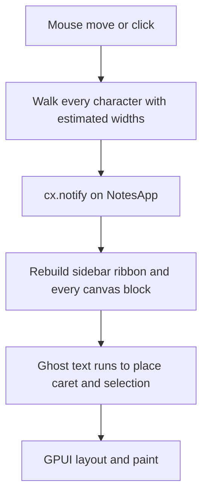

# Cursor and Selection Latency Analysis

This document explains why placing the caret and dragging a text selection slows down as the notes canvas grows, and which changes keep pointer-to-caret latency under one second.

No editor behavior is changed by this document. It is an analysis of the current code and a recommended fix order.

---

## 1. Symptom and target

Clicking into a text block, or dragging to select, updates `edit_body_cursor` only after the app rebuilds and paints the whole window. On a short plain line that still feels immediate. On a long block, with bold, italic, underline, and strike, and with many canvas items on the page, the caret arrives late and often lands a little off the glyph under the pointer.

**Failure line:** pointer-to-caret under **1 second** on a page with many blocks and mixed styles.

**Design target:** one frame, about **16 ms**. One second is the point at which the caret has failed. Sixteen milliseconds is what still feels like the pointer. The fixes below are ordered so the first ones remove the multi-second stalls, and the later ones keep the cost flat when the next feature is added.

---

## 2. What a click or drag actually does

A pointer event does not update only the caret. It hit-tests by walking characters, then asks GPUI to render `NotesApp` again. That render rebuilds the sidebar, the ribbon, every canvas block, and an invisible copy of the text used only to push the caret into place.

`NotesApp` is the only rendered entity. `Render for NotesApp` in [src/main.rs](src/main.rs) always builds the sidebar and the detail pane. The detail pane builds the ribbon, the canvas editor or viewer, and every text, image, and mixed block. `cx.notify()` on that entity invalidates all of it.

### 2.1 Hit testing

Canvas hit testing lives in `calculate_canvas_text_offset_full` in [src/text/selection.rs](src/text/selection.rs).

On every call it:

1. Converts the mouse point into a local `rel_x` / `rel_y` using the sidebar width, pan, item position, and hardcoded header padding (`6.0`, `18.0` on the drag path).
2. Splits the whole string on `\n` into a new `Vec<&str>`.
3. Walks earlier lines only to sum character counts and find the line start.
4. Walks every character of the target line, calling `get_char_width_for_font` until the running width passes the click.

`get_char_width_for_font` in [src/text/metrics.rs](src/text/metrics.rs) is a large `match` on the font and the character. Those widths are a hand-written table. They are not the advances of the glyphs GPUI shapes and draws.

`textbox_width` is accepted and then ignored (`_textbox_width`). Hit testing treats each logical line as a single unwrapped row. The painted line can wrap inside the box. The index and the pixels then disagree, so the caret jumps even when the math finishes quickly. That is the uneven part of the symptom. The late part is the rebuild described next.

The same walk runs again for every mouse-move sample while the button is held. There is no stored line start, no prefix sum of advances, and no check that the character index stayed the same.

### 2.2 Who runs that walk

The same selection update is wired in more than one place. The inner handler calls `cx.stop_propagation()`, so a click that lands on a line does not also run the parent walk. A gesture still has two owners: the line or the block while the pointer is over the text, and the canvas shell once the pointer leaves that element. Each owner hit-tests and notifies on its own.

| Surface | File | What the move handler does |
| --- | --- | --- |
| Active text block | [src/canvas/text_segment.rs](src/canvas/text_segment.rs) | If `is_selecting_body`, computes `drag_idx`, assigns `edit_body_cursor`, and always calls `cx.notify()`. |
| Canvas shell | [src/canvas/editor.rs](src/canvas/editor.rs) | On the same selecting move, computes `drag_idx` again and notifies when it marks the frame changed. |
| Read-only viewer | [src/canvas/viewer.rs](src/canvas/viewer.rs) and [src/canvas/viewer_text.rs](src/canvas/viewer_text.rs) | Same pattern for viewer selection. |
| Page heading and section name | [src/canvas/header.rs](src/canvas/header.rs) | Per-line width walk, then `cx.notify()`. |
| Note title in the sidebar | [src/views/sidebar.rs](src/views/sidebar.rs) | Same, on the sidebar field. |

In `text_segment`, the block-level `on_mouse_move` does not compare `drag_idx` with the current cursor. Every sample that hits the block notifies, including samples that stay on the same character. The line row has its own `on_mouse_down`, which walks that line and then stops propagation. The block has another `on_mouse_down` that calls `calculate_canvas_text_offset_full` on the whole buffer for clicks that miss the line rows. Either click is then followed by a full render. The canvas `on_mouse_move` in `editor.rs` repeats the full-buffer walk for selecting moves that reach the canvas, and it sets its changed flag even when the index did not move.

`capture_segment` on mouse-down searches every canvas item, clones the text and all four style span lists, and copies them into `edit_body` and the four `Vec<bool>` style buffers before the index is even computed.

### 2.3 What `cx.notify()` rebuilds

GPUI calls `NotesApp::render` again. For the active block, `render_text_segment` clones `edit_body` and the four flag vectors into a new `TextEditor`. `render_editor_with_line_wrapper` in [src/canvas/text_editor.rs](src/canvas/text_editor.rs) then, for every logical line:

- Copies that line's bold flags into a new `Vec<bool>`.
- Slices italic, underline, and strike the same way (`slice_flags` allocates).
- Splits the line into styled runs (`split_text_into_full_runs` collects every character into a `Vec<char>`, then allocates a `String` per run).
- Builds a `div` per run.

When the caret is on that line and there is no selection, it does the work a second time for the text before the caret. Those runs are painted with a transparent color (ghost runs) inside an absolutely positioned row, and the caret `div` is placed after them. GPUI's flex layout is what moves the caret to the right x. The same trick is used for the selection: a transparent copy of the text before the range, then a highlighted row of transparent runs for the selected text.

Inactive blocks pay a similar cost. `render_text_segment` converts span lists into four full-length `Vec<bool>` values (`spans_to_bool_vec`), then splits every line into runs and elements. Images and mixed blocks are rebuilt too, including their drag and resize handlers.

[src/main.rs](src/main.rs) raises the main thread stack to 64 MB because this element tree is already deep enough to overflow the default 1 MB stack on Windows. That is a size signal, not a latency fix. A deeper tree is a slower layout.

### 2.4 The caret blink

`NotesApp::new` in [src/app/editing.rs](src/app/editing.rs) spawns a loop that, every 500 ms, flips `cursor_visible` and calls `cx.notify()`. Idle time still rebuilds the whole window twice a second. During a drag, blink frames interleave with pointer frames, so the pointer and the blink compete for the same full render.

---

## 3. Why each added feature multiplies the cost

The caret path is inside the app render. A feature that adds a widget, a style, or another block adds another branch to that same function. Pointer latency then grows with the feature, even when the feature has nothing to do with the caret.

| What was added | Where it shows up on a pointer frame |
| --- | --- |
| Sidebar, ribbon, page list | Rebuilt on every `cx.notify()`, including a caret blink. |
| Multiple canvas items | [src/canvas/blocks.rs](src/canvas/blocks.rs) clones each item's text and style spans and hashes an element id, for items the pointer did not touch. |
| Mixed blocks and images | Extra block types, drag, resize, and delete handlers, all reconstructed while selecting text. |
| Bold, then italic, underline, strike | Four `Vec<bool>` buffers, cloned into `TextEditor`, sliced per line, and consulted while splitting runs. Each new style flag is another pass over the characters. |
| Styled runs instead of one string | One element per run, plus ghost runs for the caret and again for the selection. A line with many style changes becomes many elements, twice. |
| Per-character hit testing | Cost grows with line length on every mouse sample. The width table grew with each font (`Segoe UI`, `Calibri`, `Inter`, monospace, serif) and is still an estimate. |
| Pan, sidebar open/closed, header padding | Folded into the hit-test inputs. The width argument is still unused, so wrap and caret stay out of agreement as boxes get narrower. |

A click on a long styled note is therefore: a character walk, a clone of the block into the editor buffers, a full tree rebuild, a second text layout made of ghost runs, and a GPUI layout of chrome that did not change. The next feature joins that list.

Per-character `Vec<bool>` is the part that scales the worst. A span list of a few ranges becomes `len` booleans, four times, copied on the way into the editor and again per line. `insert_style_set` and `remove_style_set` in [src/text/styles.rs](src/text/styles.rs) also insert or remove one flag at a time in the middle of those vectors, which shifts the tail on every keystroke. That makes typing slower as the buffer grows, and it feeds a heavier render back into the pointer path.

---

## 4. Recommended fixes

Ordered so the first items remove the stalls without a rewrite. Steps 1–4 are enough to get typical clicks under one second. Steps 5–6 are what stop the next feature from bringing the stall back. Steps 7–8 make the caret land on the real glyph and keep off-screen work out of the frame.

### 4.1 Notify only when the index changes

In every selecting `on_mouse_move` (text segment, canvas editor, viewer, headings, sidebar), call `cx.notify()` only when the new index differs from the current cursor.

This does not change hit testing or painting. It drops the frames where the pointer is still inside the same character, which is most samples in a drag. It is the smallest change and the first one to make.

### 4.2 One hit-test owner

Pick one owner for body selection. The line-row mouse-down in [src/canvas/text_segment.rs](src/canvas/text_segment.rs) already knows `line_start` and does not need to resplit the whole buffer, so it should be the click path. Remove the block-level mouse-down that calls `calculate_canvas_text_offset_full`, and remove the block `on_mouse_move` that notifies on every sample. Keep drag updates on the canvas `on_mouse_move` in [src/canvas/editor.rs](src/canvas/editor.rs) so a drag that leaves the text block still updates the index. Do the same for the viewer: one click owner and one drag owner, not the canvas shell and the segment both notifying.

This does not change the index math. It stops one gesture from scheduling a render from each owner.

### 4.3 Cache line geometry

When the text, font, font size, or style spans change, build a small cache and keep it:

- For each logical line: start index in the buffer, and a prefix sum of horizontal advances.
- The y of a line stays `line_index * line_height` until wrapping is added.

Hit testing then picks the line from `rel_y` and binary-searches that line's prefix sum. Rebuild the cache on edit, font change, or style change. Do not rebuild it on pointer move.

This does not change how text is painted. It changes the pointer path from "walk every character of the line, every sample" to "search a table that already exists."

### 4.4 Place the caret from that cache

Draw the caret at `left: prefix_sum[local_cursor]` and the selection highlight as a rectangle from `prefix_sum[start]` to `prefix_sum[end]`. Delete the transparent ghost runs in `render_editor_with_line_wrapper` (the caret block around the `before_prefix` runs, and the selection block that builds `before_ghosts` and `sel_ghosts`).

This removes a second full split-and-layout of the line on every blink and every drag frame. The visible styled runs stay. Only the invisible copies go.

Until step 7, the caret uses the same advance table as hit testing, so the click and the caret agree with each other even if both still differ slightly from the shaped glyphs.

### 4.5 Split the active text block into its own entity

Make the active text block a GPUI entity (or a small child view) whose `render` is only that block. `cx.notify()` on it repaints the block. It does not rebuild the ribbon, the sidebar, the page list, or the other canvas items.

`NotesApp` keeps note state, selection, and pan. The block entity reads the buffer and the geometry cache. Pointer moves update the block.

This is the change that keeps latency flat as features are added to the rest of the window. Steps 1–4 make today's page fast. Step 5 stops the next pane or control from joining the caret frame.

### 4.6 Blink only the caret

The 500 ms loop should toggle the caret element, not `NotesApp`. Put the caret in the block entity from step 5, or in a tiny child whose render is the 2 px bar, and notify that entity.

Blinking then stays off the sidebar, the ribbon, and every other block. During a drag, blink frames stop competing with pointer frames for a full-window layout.

### 4.7 Match real glyphs

Replace `get_char_width_for_font` for hit testing and caret x with GPUI's shaped line. Shape each line once (the same moment the geometry cache is built) and use the shaped line's index-for-x and x-for-index. The caret then sits on the glyph under the pointer, including bold advances, which the generic weight multiplier only approximates (`effective_weight_multiplier` exists because a flat 10% bold width was already drifting).

Use the cached advances from step 4.3 until shaping is wired in. After this step, the cache stores shaped positions instead of table estimates.

Wrapping belongs here too. Pass the real box width into the shaper, and store wrapped rows in the cache. `_textbox_width` becomes an input instead of an unused argument. Hit testing and paint then share one wrap.

### 4.8 Keep styles as spans, and skip off-screen blocks

Paint from the span lists (`bold_spans` and the other three) directly. Expand to `Vec<bool>` only while an edit needs per-character insert and delete. That removes `spans_to_bool_vec` and the four cloned flag vectors from the inactive-block render, and it removes the per-line `slice_flags` copies from the active editor.

While rendering the canvas, skip items whose bounds sit fully outside the visible pan rectangle. Off-screen text is not split into runs and is not given mouse handlers until it scrolls into view.

This does not change the stored note format. Spans are already what gets saved. The flag vectors are a render-time expansion.

---

## 5. What to measure

Time from mouse-down to the frame that shows the caret at the new index. Do the same for a drag: time from a mouse-move sample to the frame that shows the updated selection end.

Check two pages:

1. One long block with mixed bold, italic, underline, and strike, several hundred characters per line and many lines.
2. A page with many text, image, and mixed blocks, selection inside one of them.

Record the number separately for a click that changes the index and for a drag sample that stays inside the same character. After step 4.1, the second number should drop to "no render." After steps 4.3 and 4.4, the first number should fall because the walk and the ghost layout are gone. After steps 4.5 and 4.6, adding a sidebar or ribbon control should leave the caret number about the same.

Pass condition: both pages stay under one second, with the implementation aimed at one frame.

A useful trace is a timestamp at the start of the mouse handler and a timestamp at the end of `NotesApp::render` on the frame that follows `cx.notify()`. The gap is the latency this document is about. Hit-test time and render time should be logged apart, so a slow walk is not mistaken for a slow layout.
