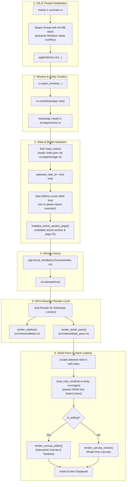

# NotesApp Startup Flow

This document details the startup and initial screen loading lifecycle of the GPUI-based Notes application, documenting how execution flows from OS thread entry down to the first frame render.

---

## 1. High-Level Summary (Short Answer)

The core lifecycle flow is:

```text
main() 
  ➔ cx.new(NotesApp::new) 
  ➔ NotesApp::new loads notes 
  ➔ initialize_active_section_page() sets selection 
  ➔ GPUI calls Render for NotesApp 
  ➔ render_sidebar() + render_detail_pane() 
  ➔ load_note_content() 
  ➔ render_canvas_viewer/editor() 
  ➔ initial screen appears
```

> [!NOTE]
> **Key Architectural Insight:**  
> The actual *"initial screen loading"* is completed by GPUI's reactive render pipeline—specifically [`render_detail_pane()`](src/views/detail_pane.rs) and [`load_note_content()`](src/models.rs)—and **not** by a separate manual loader function after [`NotesApp::new`](src/app/actions.rs).

---

## 2. Startup Call Tree

```text
main()
└── application().run(...)
    └── cx.open_window(...)
        └── closure:
            └── cx.new(NotesApp::new)
                └── NotesApp::new()
                    ├── Self::load_notes()
                    │   └── src/app/storage.rs
                    │       └── reads notes.json
                    ├── selected_note_id = first note
                    ├── initialize default app state
                    ├── starts cursor blink timer
                    └── initialize_active_section_page()
                        └── picks valid active section/page for selected note

            └── app.focus_handle(cx).focus(window, cx)

            └── GPUI render cycle starts
                └── impl Render for NotesApp
                    └── render()
                        ├── render_sidebar()
                        │   └── builds left panel
                        └── render_detail_pane()
                            ├── find selected note
                            ├── load_note_content(&note.body, &note.images)
                            │   └── models.rs
                            ├── active section/page selected
                            ├── if editing:
                            │   └── render_canvas_editor()
                            │       └── builds editor UI
                            └── else:
                                └── render_canvas_viewer()
                                    └── builds viewer UI
```

---

## 3. Visual Flowchart



---

## 4. Detailed Step-by-Step Breakdown

### Step 1: Thread Sizing & GPUI App Launch (`src/main.rs`)
* **Thread Stack:** Windows threads default to a 1 MB stack. Because GPUI element trees and canvas layout recursions can be deep, `main()` explicitly spawns a thread named `notes-main` with a **64 MB stack** before calling `application().run(...)`.
* **Window Creation:** Inside the application runner, `cx.open_window` initializes the native OS window (centered at 800x600 default bounds).

```rust
let stack_size = 64 * 1024 * 1024; // 64 MB
let builder = std::thread::Builder::new().name("notes-main".to_string()).stack_size(stack_size);
let handler = builder.spawn(|| {
    application().run(|cx: &mut App| {
        let bounds = Bounds::centered(None, size(px(800.0), px(600.0)), cx);
        cx.open_window(
            WindowOptions {
                window_bounds: Some(WindowBounds::Windowed(bounds)),
                ..Default::default()
            },
            |window, cx| {
                let app = cx.new(NotesApp::new);
                app.focus_handle(cx).focus(window, cx);
                app
            },
        ).expect("failed to open Notes window");
        cx.activate(true);
    });
});
```

---

### Step 2: State Initialization & Persistence Loading (`src/app/actions.rs`)
Inside `NotesApp::new(cx)`:
1. **Load Data:** Calls `Self::load_notes()` (implemented in [`src/app/storage.rs`](src/app/storage.rs)), which reads and parses `notes.json` from disk.
2. **Default Selection:** Selects the first available note:
   ```rust
   let selected_note_id = notes.first().map(|n| n.id.clone());
   ```
3. **App State Initialization:** Populates fields like panning coordinates (`pan_x`, `pan_y`), edit state flags (`is_editing = false`), focus handles, and UI dimensions.
4. **Blink Loop:** Launches an asynchronous background executor timer via `cx.spawn(...)` that toggles `cursor_visible` every 500 ms and triggers `cx.notify()`.
5. **Section/Page Resolution:** Calls `app.initialize_active_section_page()` to ensure that the selected note has valid default section and page IDs assigned for immediate viewing.

---

### Step 3: View Dispatch & GPUI Render Cycle (`src/main.rs`)
GPUI begins its paint cycle by invoking `Render::render()` on `NotesApp`:

```rust
impl Render for NotesApp {
    fn render(&mut self, window: &mut Window, cx: &mut Context<Self>) -> impl IntoElement {
        let sidebar = self.render_sidebar(window, cx);
        let detail_pane = self.render_detail_pane(window, cx);

        div()
            .id("notes-app")
            .track_focus(&self.focus_handle)
            .on_key_down(cx.listener(|this, event, _, cx| {
                this.handle_key(event, cx);
            }))
            .flex()
            .flex_row()
            .size_full()
            .bg(rgb(0x1e1e1e))
            .text_color(rgb(0xd4d4d4))
            .font_family("Segoe UI")
            .child(sidebar)
            .child(detail_pane)
    }
}
```

---

### Step 4: Detail Pane & Note Parsing (`src/views/detail_pane.rs`)
When `render_detail_pane()` runs:
1. It looks up the note corresponding to `self.selected_note_id`.
2. It parses the raw JSON body into the in-memory `NoteContent` hierarchy via `load_note_content(&note.body, &note.images)` (from [`src/models.rs`](src/models.rs)).
3. It builds the right vertical page navigation list based on active sections.
4. It branches based on `self.is_editing`:
   * **Edit Mode (`true`):** Calls `render_canvas_editor(...)` to build interactive editable text blocks, image blocks, and toolbars.
   * **Viewer Mode (`false`):** Calls `render_canvas_viewer(...)` to build clean, read-only canvas blocks.
5. The assembled tree of GPUI elements is returned and rasterized to the window, making the application fully visible and interactive.

---

## 5. Architectural Takeaways

1. **Separation of Concerns:**
   * **`NotesApp::new()`**: Handles data retrieval, state defaults, and timer handles.
   * **`render()` / `render_detail_pane()`**: Pure reactive composition of GPUI elements based on existing state.
2. **No Post-Constructor Loader Required:**
   * The app doesn't require a secondary manual trigger or lifecycle callback (such as `componentDidMount` or `on_init`) to load the screen content.
   * As soon as GPUI calls `render()` on the window root, `render_detail_pane()` dynamically pulls the selected note and parses its structure for immediate presentation.
